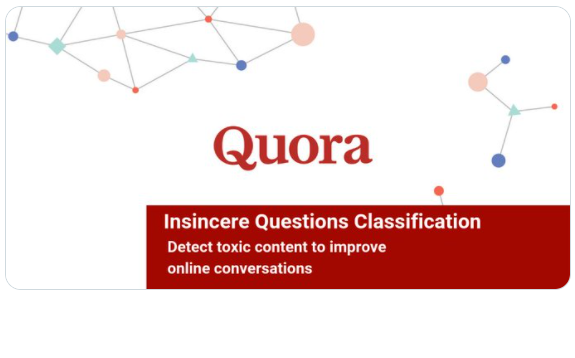
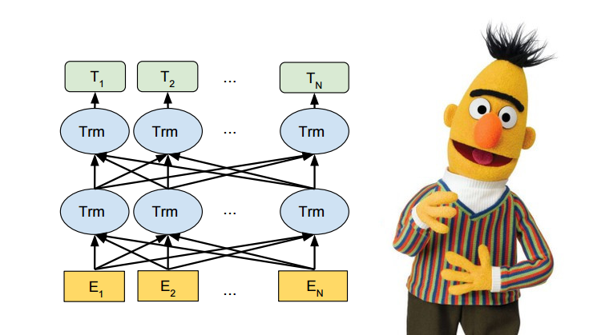
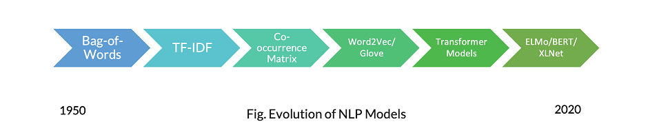

# NLP-classification_of_text_with_BERT
Classification of raw text sequences to two labels.  
Classified are questions on quora to sincere and insincere.  

Dataset is taken from:  
https://www.kaggle.com/c/quora-insincere-questions-classification

